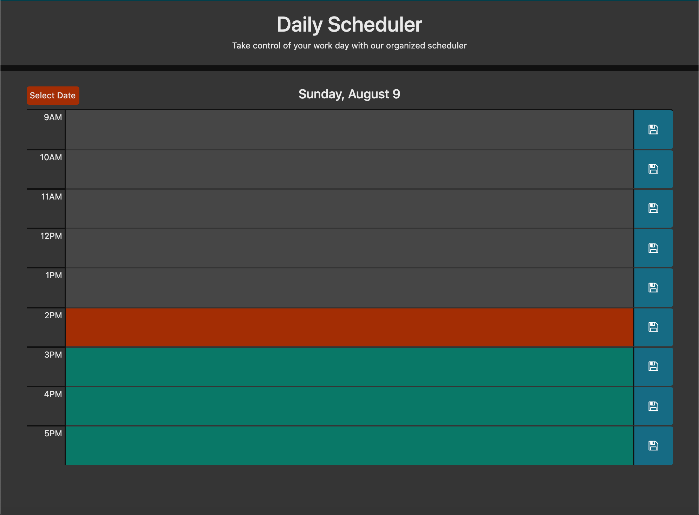

# Day Planner

## Description

Calendar application that allows the user to save events for each work hour of a selected day.

## Features

- Displays standard business hours (9 a.m. to 5 p.m.)

- Each row contains:

    - the time
    
    - a field to hold user input
    
    - and a save button.

- Save button stores the date, time, and user input in local storage.

- Upon new date selection, retrieves corresponding user input from local storage and displays in corresponding hour's text field.

- Top of schedule displays the currently selected day. 

- Color coded hour rows determined by past, present, or future dates/time.

- Utilizes JQuery UI datepicker

- Mobile responsive layout

- Dark theme

## Preview

## Github Link

https://sheplt1.github.io/Day-Planner/